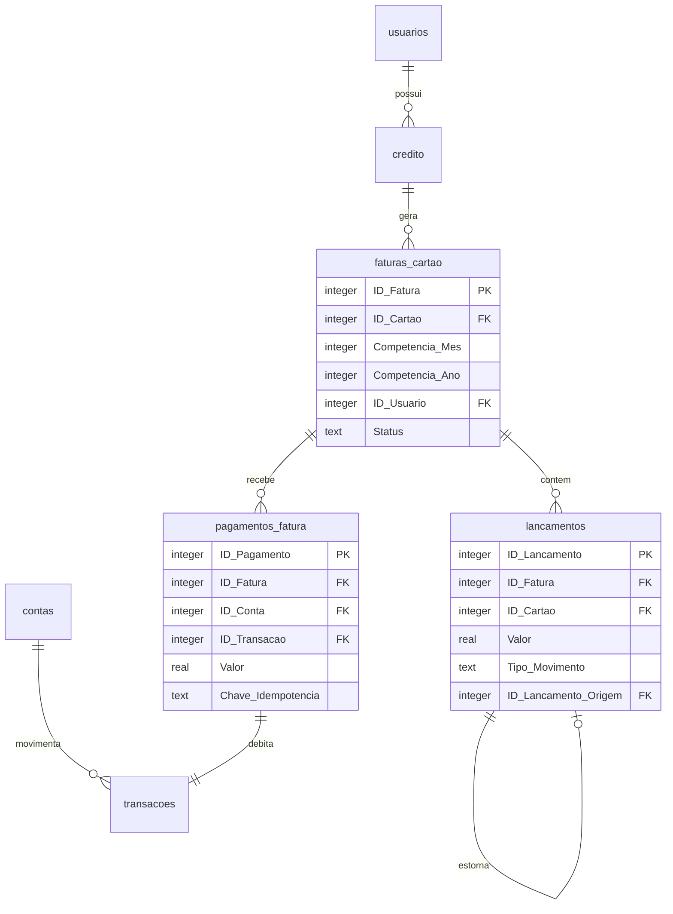

# Arquitetura das faturas de cartão

## Fonte de verdade

Cada tabela tem uma responsabilidade única:

| Tabela | Responsabilidade |
| --- | --- |
| `credito` | Cadastro do cartão: limite, fechamento, vencimento e proprietário. |
| `faturas_cartao` | Ciclo mensal do cartão e seu estado `ABERTA`, `FECHADA` ou `PAGA`. |
| `lancamentos` | Movimentos da fatura: compra positiva, crédito negativo e pagamento negativo. |
| `pagamentos_fatura` | Registro idempotente e auditável de cada pagamento. |
| `transacoes` | Movimento real da conta bancária usada no pagamento. |
| `contas` | Saldo da conta bancária. |

`faturas_cartao.ID_Fatura` é a identidade da fatura. `lancamentos.ID_Fatura` e
`pagamentos_fatura.ID_Fatura` apontam para ela. O estado financeiro da fatura é
lido de `faturas_cartao.Status`; a coluna histórica `lancamentos.Paga` continua
somente para compatibilidade com bancos antigos e não decide o ciclo.

## Regras de consistência

- A combinação cartão, competência e usuário é única em `faturas_cartao`.
- Gatilhos do SQLite recusam um `ID_Fatura` incompatível com cartão,
  competência ou usuário nos lançamentos e pagamentos.
- Compra usa valor positivo. Cashback, estorno, devolução, desconto, ajuste e
  pagamento usam valor negativo na fatura.
- O pagamento cria uma saída negativa em `transacoes` e não altera o sinal das
  compras já registradas.
- Ao fechar um ciclo, compras novas são vinculadas automaticamente à próxima
  competência aberta.
- A migração é aditiva: cria e preenche vínculos sem apagar as tabelas ou os
  registros existentes.

As colunas `ID_Cartao`, `Competencia_Mes`, `Competencia_Ano` e `ID_Usuario`
permanecem nos registros filhos durante a compatibilidade com versões antigas.
Elas são dados espelhados e validados, não uma segunda fonte de estado.
